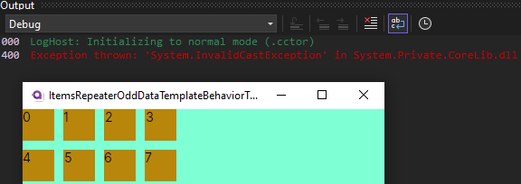
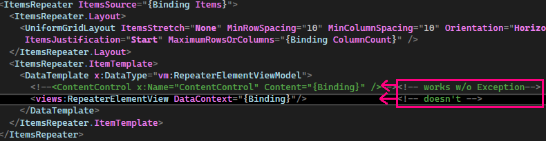

# ItemsRepeaterOddDataTemplateBehaviorTest 
[Avalonia Version `11.0.1`]

This repository demonstrates an issue with an `InvalidCastException` that occurs when using the `View` directly inside the `ItemRepeaterElement-Item-/Data-Template`, rather than viewing the ViewModel using a `ContentControl`.

The image above showcases the exception occuring - but the Project builds and runs nevertheless.

Above an example that shows which syntax works without Exception and which doesn't.

## To replicate

1. Clone this repository to your local machine.
2. Open the solution in Visual Studio.
3. Build and run the solution to reproduce the `InvalidCastException`.

