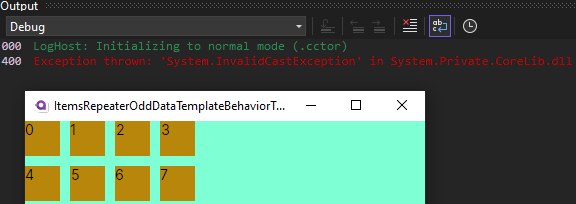

# ItemsRepeaterOddDataTemplateBehaviorTest

This repository demonstrates an issue with an `InvalidCastException` that occurs when using the `View` directly inside the `ItemRepeaterElement-Item-/Data-Template`, rather than the `ContentControl`.

The image above showcases the exception in action. We are actively investigating this issue and welcome any insights or suggestions.

## Getting Started

1. Clone this repository to your local machine.
2. Open the solution in Visual Studio.
3. Build and run the solution to reproduce the `InvalidCastException`.

Thank you for your interest in this project and your patience as we work to resolve this issue.
